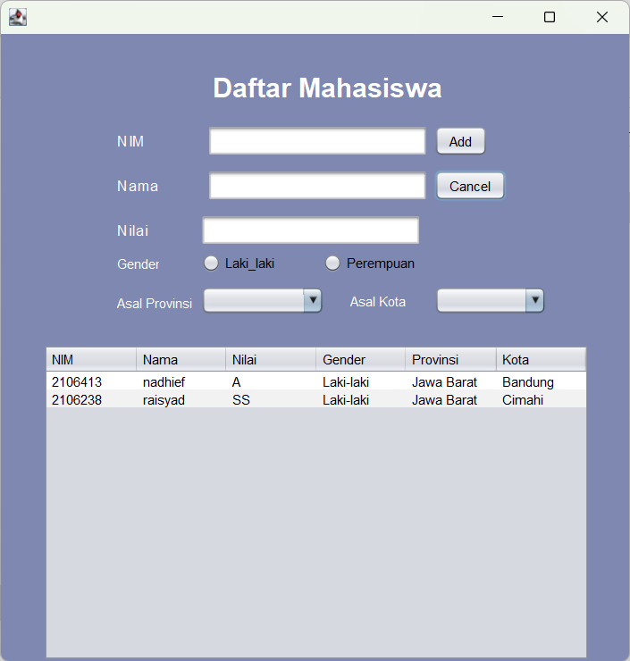

## Janji
Saya Nadhief Athallah Isya NIM 2106413 mengerjakan soal Latihan 5
dalam mata kuliah Desain Pemrograman Berorientasi Objek untuk keberkahanNya
maka saya tidak melakukan kecurangan seperti yang telah dispesifikasikan.
Aamiin.

## Tugas LATIHAN4DPBO2023

## Desain Program
Desain yang saya buat dalam tugas ini ini memiliki 6 kolom yaitu nim nama nilai gender provinsi dan kota. nim nama nilai bertipe textfield. gender radio button trus dijadiin button group. provinsi dan asal kota menggunakanan dropdown. asal kota dilihat dari provinsinya jika jawa barat maka kota yang keluar hanya kota yang ada di jawa barat saja. di program ini bisa insert data, update, dan delete.

## Dokumentasi Program
